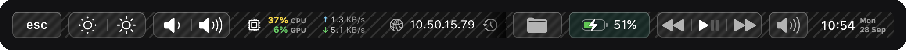
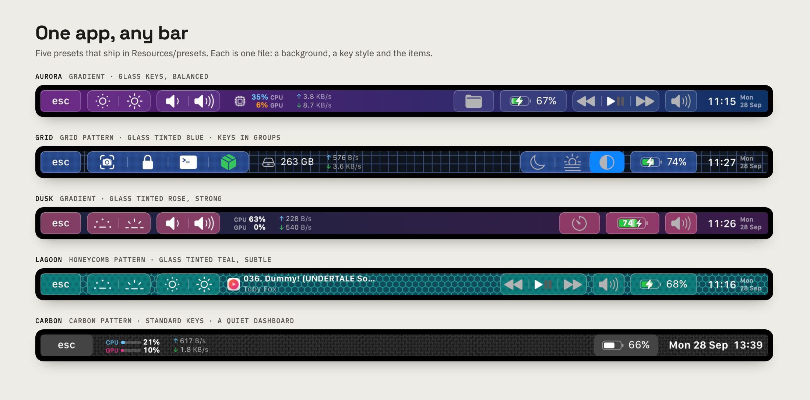
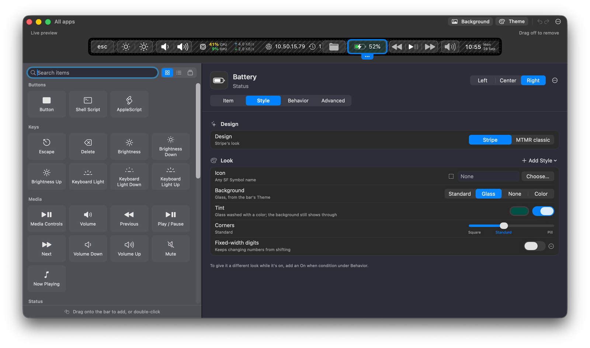
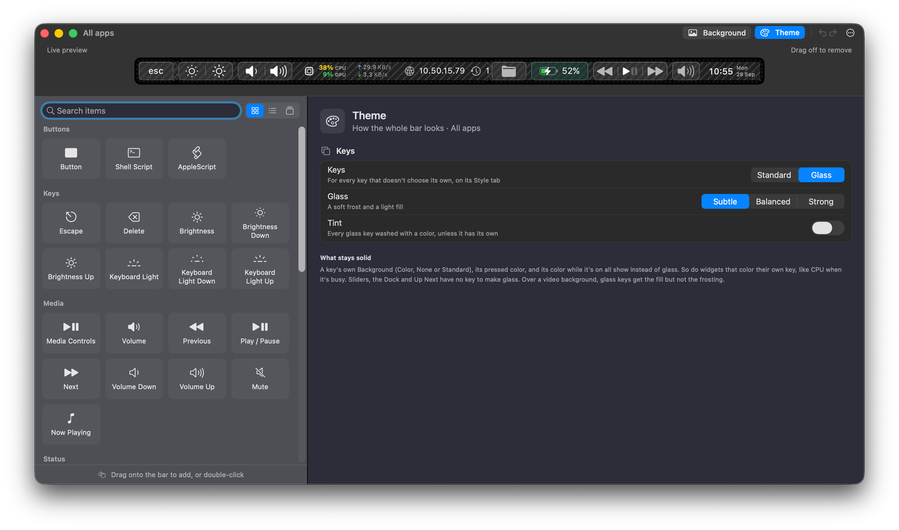
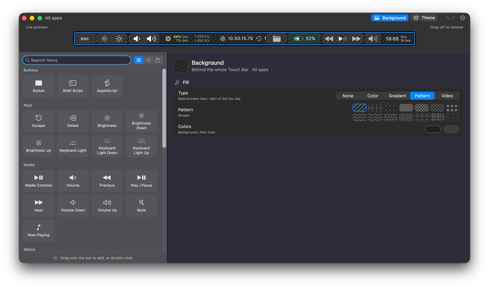
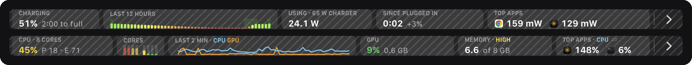
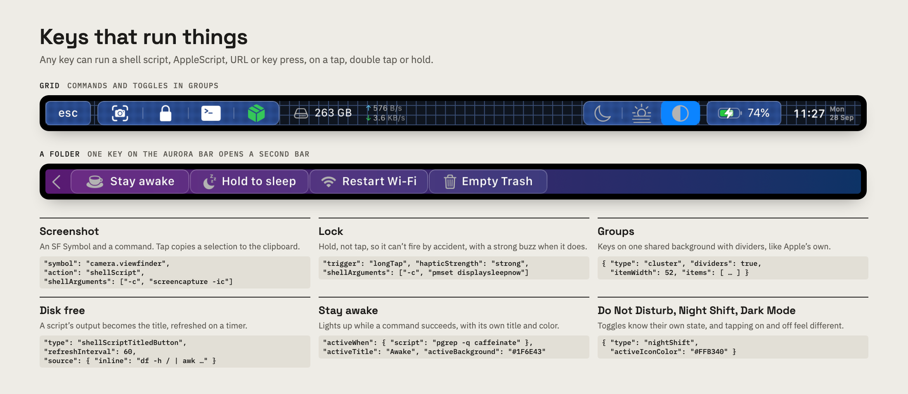
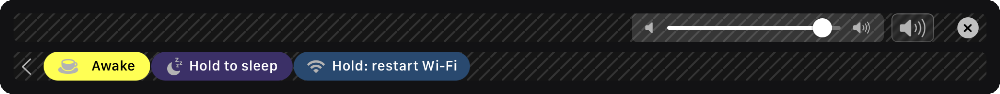
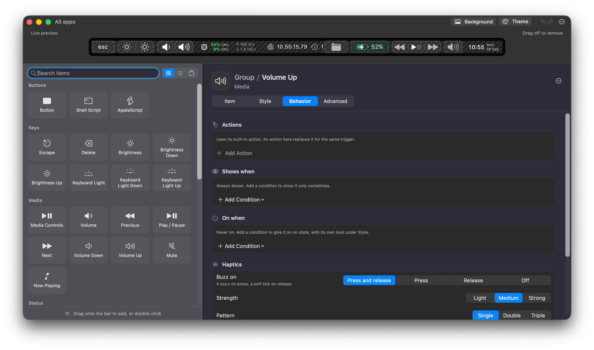

<h1 align="center">Stripe</h1>

<p align="center"><b>The Touch Bar, finally finished.</b><br>
The next evolution of <a href="https://github.com/Toxblh/MTMR">MTMR</a>: design your bar in a live editor, with glass keys, full-bar dashboards and haptics you can feel.</p>

<p align="center">


</p>



> **Stripe is in alpha.** It's usable every day and most things work, but expect rough edges, and the preset format may still change between builds. Keep a copy of your preset, and please [open an issue](https://github.com/ILFforever/Stripe/issues) when something breaks.

MTMR proved the Touch Bar could be yours: any button, any script, any layout, in one JSON file. Stripe keeps all of that, and every MTMR preset still loads. Then it adds what MTMR never had: a visual editor, a look that matches Apple's own controls, and widgets that turn the whole bar into a dashboard when you need one.

## One app, any bar



Every bar above is a single preset file in [`Resources/presets`](Resources/presets). To try one, copy it over your preset (back yours up first):

```sh
cp ~/Library/Application\ Support/Stripe/items.json ~/items.backup.json
cp Resources/presets/grid.json ~/Library/Application\ Support/Stripe/items.json
```

Stripe reloads the bar as soon as the file changes.

## Design it live, not in JSON



- **A live preview at the bar's real size.** Drag items in from the library, move them between the left, center and right, and drop them into folders and popovers. The real Touch Bar updates as you go.
- **An inspector for every item.** Item, Style, Behavior and Advanced tabs show only what applies to that item and only what you've changed. The item's raw JSON is under Advanced when you want it.
- **My Items.** Save an item you've styled and reuse it on any bar.
- **Undo and redo**, and a preset file that's still plain JSON underneath.

## A bar that looks like it shipped with the Mac



- **Glass keys.** Frosted keys with a thin, top-lit rim, in Subtle, Balanced or Strong, tinted any color for the whole bar or per key. Or keep Apple's standard keys.
- **Bar backgrounds.** A color, a gradient, one of 14 patterns (grid, carbon, honeycomb…) or a looping video behind every key. Videos pause on battery if you want.
- **Every key, your way.** SF Symbols, font weight, text and icon colors, and corners from square to pill on one slider. Each item can switch between the Stripe look and MTMR classic.
- **Key groups.** Brightness, Keyboard Light, Volume and Media Controls come as ready-made groups: keys on one shared background with dividers, like Apple's own.



## Full-bar dashboards



- **Battery.** Hold the battery item to open a page with charge and time to full, a 12-hour history, charger wattage, time since you plugged in, and which apps are using the most power.
- **CPU and GPU.** Live readouts on the bar. Tap one for a page with per-core load, a two-minute graph, GPU usage, memory pressure and the busiest apps, or hold it to open Activity Monitor. You pick which tiles show.
- **Network speed**, **now playing**, **weather**, **calendar**, **pomodoro** and the rest of MTMR's widgets are all still here.

## Keys that run things



- **Any key runs a command.** A shell script, an AppleScript, a URL or a key press, on a single, double or triple tap, or a hold.
- **Hold for anything risky.** A `longTap` action only fires once you've held long enough, with a strong buzz so you know it did.
- **Scripts as live titles.** A script's output becomes the key's text, refreshed on the interval you pick.
- **Keys that light up.** `activeWhen` turns a key on while a command succeeds, with its own title, icon and color.
- **Groups of commands.** Put related keys on one shared background with dividers, the way Apple groups brightness and volume.

## Folders and popovers



- **Popovers** open their controls in place, on the same side as the button. Press, hold and slide to change the volume without even opening one.
- **Folders** hold a whole second bar behind one key: scripts, toggles, anything.
- **On states.** A key can light up and change its icon, color and title while something is true: Do Not Disturb is on, a script succeeds, an app is in front.
- **Conditions and per-app bars.** Show an item only for certain apps, at certain times or while a command succeeds, or give an app a bar of its own.

## Haptics you can tune



The Touch Bar has no feedback of its own, so Stripe plays it through the trackpad's actuator.

- **Per item:** buzz on press, release, both or neither, at Light, Medium or Strong, as a single, double or triple tap. **Try it** plays it on the trackpad right there in Settings.
- **Toggles you can feel.** A tap that turns something on feels different from one that turns it off.
- **Detents on sliders.** Volume and brightness tick as you drag, with a firmer stop at each end.
- **Hold to repeat.** Hold a brightness or volume key and it keeps stepping by the amount you choose, with the system overlay up and a buzz that builds as you go up and fades as you go down.

## Also new

- **Snappier.** Apple Events and scripts stay off the main thread, and the bar reloads in place instead of flickering.
- **Builds with just the Command Line Tools.** No Xcode, and Sparkle auto-updates are removed.

The full rules for every item, its states and which settings apply are in [ITEMS.md](ITEMS.md).

## Installation

Stripe is in alpha and there are no prebuilt releases yet, so build from source (details in [DEVELOPING.md](DEVELOPING.md)):

```sh
xcode-select --install                   # Command Line Tools, if you don't have them
build-support/make-signing-identity.sh   # once per Mac; keeps Accessibility access across rebuilds
make install                             # builds Stripe.app, copies it to /Applications and launches it
```

**On first launch**, allow Stripe in **System Settings → Privacy & Security → Accessibility**. Without it, <kbd>Esc</kbd>, volume, brightness and other simulated keys won't work. The menu-bar menu shows **Allow Accessibility for Media Keys…** until access is granted.

## Using Stripe

Stripe lives in the menu bar. From its menu you can:

- open **Stripe Settings…** (<kbd>⌘,</kbd>), the visual editor
- turn on **Open at Login**
- choose **Hide Stripe for “App”** to give the frontmost app its normal Touch Bar back
- under **Options**, toggle haptic feedback, the Control Strip, and volume and brightness gestures
- under **Advanced**, choose **Edit JSON…** or **Open Preset File…**

## Customization

The main preset lives in `~/Library/Application Support/Stripe/items.json`. The Settings window edits this file, and you can also edit it by hand. Stripe reloads the bar when the file changes.

### Per-app presets

Put a preset at `~/Library/Application Support/Stripe/apps/<bundle-id>.json` (for example `apps/com.apple.Safari.json`). Stripe switches to it while that app is in front and switches back to the main preset afterwards.

### Styling

Any button-based item accepts these keys:

```js
{
  "type": "cpu",
  "symbol": "cpu",            // SF Symbol name used as the icon
  "iconColor": "#34C759",
  "fontSize": 13,
  "fontWeight": "semibold",
  "textColor": "orange",      // named color or hex
  "monospacedDigits": true,
  "cornerRadius": 8           // or "style": "pill"
}
```

### Conditions (`when`)

Every check you list has to pass for the item to show:

```js
"when": {
  "app": "Safari|Chrome",       // regex on the frontmost app's bundle ID or name
  "notApp": "Finder",           // hide while a matching app is in front
  "time": "09:00-18:00",        // local time window; can wrap past midnight
  "script": "pgrep -q docker",  // show while this shell command exits 0
  "every": 10                   // seconds between script checks (default 10)
}
```

The older `matchAppId` key still works and behaves like `"app"`.

### Popovers

```js
{
  "type": "popover",
  "symbol": "speaker.wave.2.fill",
  "items": [ { "type": "volume" }, { "type": "mute" } ],
  "pressAndHold": true,  // hold and slide to adjust the first item
  "autoClose": 4,        // optional: collapse after this many idle seconds
  "liveIcon": true       // with a volume slider first, the icon shows the current level
}
```

The controls open on the same side of the bar as the button. Tap ✕ or any empty part of the bar to close them.

### Battery

```js
{
  "type": "battery",
  "showIcon": true,
  "showPercentage": true,
  "percentInside": false,  // draw the percentage inside the icon, as on iPhone
  "showTime": false,
  "animate": true,         // charging animation
  "lowThreshold": 20,
  "tapToCycle": true       // tap to switch to time remaining and back
}
```

Press and hold the battery item to open its page across the bar (`"holdOpens": "settings"` opens Battery settings instead).

## Built-in button types:

> Buttons

- escape
- exitTouchbar
- brightnessUp
- brightnessDown
- illuminationUp (keyboard illumination)
- illuminationDown (keyboard illumination)
- volumeDown
- volumeUp
- mute

> Native Plugins

- timeButton
- battery
- cpu
- currency
- weather
- yandexWeather
- inputsource
- music (tap for pause, longTap for next)
- dock (half-long click to open app, full-long click to kill app)
- nightShift
- dnd (Do Not Disturb; runs a shortcut named "Stripe Do Not Disturb" that you make once in Shortcuts: Set Focus › Do Not Disturb › Toggle)
- darkMode
- pomodoro
- network
- upnext (Calendar events)

> Media Keys

- previous
- play
- next

> AppleScript plugins

- sleep
- displaySleep

> Custom buttons

- staticButton
- appleScriptTitledButton
- shellScriptTitledButton

## Gestures

Turn on basic gestures from the menu bar (Stripe → Options → Volume & Brightness Gestures):
- two finger slide: change you Volume
- three finger slide: change you Brightness

### Custom gestures

You can add custom actions for two/three/four finger swipes. To do it, you need to use `swipe` type:

```json
    "type": "swipe",
    "fingers": 2,            // number of fingers required (2,3 or 4)
    "direction": "right",    // direction of swipe (right/left)
    "minOffset": 10,          // optional: minimal required offset for gesture to emit event
    "sourceApple": {         // optional: apple script to run
        "inline": "beep"
    },
    "sourceBash": {          // optional: bash script to run
        "inline": "touch /Users/lobster/test"
    }
```

You may create as many `swipe` objects in the preset as you want.

## Built-in slider types:

- brightness
- volume

### You can also make custom buttons using these types

#### `staticButton`

```json
 "type": "staticButton",
 "title": "esc",
```

#### `appleScriptTitledButton`

```js
  {
    "type": "appleScriptTitledButton",
    "refreshInterval": 60, //optional
    "source": {
      "filePath": "~/Library/Application Support/Stripe/iTunes.nowPlaying.scpt",
      // or
      "inline": "tell application \"Finder\"\rif not (exists window 1) then\rmake new Finder window\rset target of front window to path to home folder as string\rend if\ractivate\rend tell",
      // or
      "base64": "StringInbase64"
    },
  }
```

> Note: You can change appleScriptTitledButton's icon by following these steps:
1. Declare dictionary of icons in `alternativeImages` field
2. Make you script return array of two values - `{"TITLE", "IMAGE_LABEL"}`
3. Make sure that your `IMAGE_LABEL` is declared in `alternativeImages` field

Example:
```js
  {
    "type": "appleScriptTitledButton",
    "source": {
      "inline": "if (random number from 1 to 2) = 1 then\n\tset val to {\"title\", \"play\"}\nelse\n\tset val to {\"title\", \"pause\"}\nend if\nreturn val"
    },
    "refreshInterval": 1,
    "image": {
      "base64": "iVBORw0KGgoAAAANSUhEUgA..."
    },
    "alternativeImages": {
      "play": {
        "base64": "iVBORw0KGgoAAAANSUhEUgAAAAAA..."
      },
      "pause": {
        "base64": "iVBORw0KGgoAAAANSUhEUgAAAIAA..."
      }
    }
  },
```

#### `shellScriptTitledButton`
> Note: script may also use escape sequences to return colors (read https://misc.flogisoft.com/bash/tip_colors_and_formatting for more information)
> "16 Colors" is the only mode supported presently. Buttons will set their own background color to the color returned.

Example of "CPU load" button which also changes color based on load value (Note: The native `cpu` plugin runs runs better):
```js
{
  "type": "shellScriptTitledButton",
  "width": 80,
  "refreshInterval": 2,
  "source": {
    "inline": "top -l 2 -n 0 -F | egrep -o ' \\d*\\.\\d+% idle' | tail -1 | awk -F% '{p = 100 - $1; if (p > 30) c = \"\\033[33m\"; if (p > 70) c = \"\\033[30;43m\"; printf \"%s%4.1f%%\\n\", c, p}'"
  },
  "actions": [
    {
      "trigger": "singleTap",
      "action": "appleScript",
      "actionAppleScript": {
        "inline": "activate application \"Activity Monitor\"\rtell application \"System Events\"\r\ttell process \"Activity Monitor\"\r\t\ttell radio button \"CPU\" of radio group 1 of group 2 of toolbar 1 of window 1 to perform action \"AXPress\"\r\tend tell\rend tell"
      }
    }
  ],
  "align": "right",
  "image": {
    // Or you can specify a filePath here.
    // Images will be resized to 24x24.
    // "filePath": "~/myproject/myimage.jpg" // or "/fixed/path/to/the.png"
    "base64":
    "iVBORw0KGgoAAAANSUhEUgAAAEAAAABACAMAAACdt4HsAAAABGdBTUEAALGPC/xhBQAAACBjSFJNAAB6JgAAgIQAAPoAAACA6AAAdTAAAOpgAAA6mAAAF3CculE8AAAA/1BMVEUAAADaACbYACfYACfjABzXACjYACfXACjYACfYACfYACfYACfdACLYACfXACjYACfVACv/AADXACjYACfYACfXACjYACfXACjaACXYACfYACfVACvYACfYACfZACbZACbYACfYACfZACb/AADYACfYACfVACrXACjVACu/AEDYACfYACfYACfXACjXACjYACfXACjYACfYACfYACfXACjYACfXACjYACfYACfZACbYACfYACfMADPYACfYACfYACfYACfYACfZACbXACjYACfYACfRAC7XACjYACfZACbWACnXACjXACjYACfTACzZACb/AADYACfYACfYACcAAAA+zneGAAAAU3RSTlMAItK+CVPjh3xUxPwPiGDQGAMtSKmN3Vk+wPQG/e26oIJBnwJCdiuAHgTmw+6BX+IgfaqLUvKOW8VKnagK+vBwYrhlc/urCznvhSyUbOEXPAFjGh/ektAAAAABYktHRACIBR1IAAAACXBIWXMAAA3XAAAN1wFCKJt4AAAAB3RJTUUH4ggWETQWgEDcSgAAAqVJREFUWMPtl4ly2jAQhsUNNlcw5r4SICEHLSQhCQRyX73T/u//LpUlLIyxbMAznWmn/0ywo5U+27tr7ZoQuwLBUJidRKIxPhKLRtgxHAoGiLfiQIKdKFCTxjGpQmEDCSC+BiAFpNlJBsgaxyyQYQNpIPUf8AcAOzktD+iaoQJQNI5FoMAGdCCv5XZclpfKFXiqUi5Jllf1mvdyQzW96gigd4h6o+mhRp1O0x3vvwa1VSWeqrZU1Jyeogy01ggSVQsoO/i/gjq9/u6u+2LDXq2jshqLHNCgdsCVwO0NILdi0oDmuoAmoImhQDzFRPNnb36L7U43NVfc2EH2D9h5t9OePyIF5IU9uIhvkyN7iiXmQUIOj8x/lB6f0bTaQ3ZA+9iaNCH2Lpg6btsBIRJOpJl0E9ABTvof5kqEGeCjMaN/AnRMgM5XJcI2J1J1gf6S48Tb2Ae6JkAjdgmAeJ1XAOJ1Xg8wGJ6elXwAzkeGjy62BgxG3MuXnoCIkmEq8EQyAUPgajyhPxJAga9SIiRqzwMOuAbGZDrDjQRgKkpiqiPgFphM74B7d4BKy2cyy1RcBvSodUb/HiSAIl+VlEfh8cm4wvPL9nnw+gbc+kkkUVioO95etwe8PBuP8vQoBzg7UQAe5t7syZwoCaMA3AN30wlzh3MYJYkkADeYTckYuJYlkiSVBeCKZtSY/gxlqezlxEt+pdFg6zBesPXn1ih8Aj5vkAels9PhYCkPsl++kg0AQu4dyuqmugIQm+qS5Nv6N+D7wm7d1skPc4xu666Fhd6BxU6r+jub8tNaWNxK29EhsdpR/sVn7FlLm0txPdgni+JrFNd3p+K67MQtyrsp3w2G7xbHd5Plv83z3Wj6b3V9N9ssFv7afaa//ZPn3wD4/vje8PP/N7TebS0hgZhEAAAAJXRFWHRkYXRlOmNyZWF0ZQAyMDE4LTA4LTIyVDE3OjUyOjIyKzAyOjAwc2qUYAAAACV0RVh0ZGF0ZTptb2RpZnkAMjAxOC0wOC0yMlQxNzo1MjoyMiswMjowMAI3LNwAAAAZdEVYdFNvZnR3YXJlAHd3dy5pbmtzY2FwZS5vcmeb7jwaAAAAAElFTkSuQmCC"
  },
  "bordered": false
}
```

## Groups

```js
{
  "type": "group",
  "align": "center",
  "bordered": true,
  "title": "stats",
  "items": [
    { "type": "play" },
    { "type": "mute" },
    ...
  ]
}
```

To close a group, use the button:

```
{
  "type": "close",
  "width": 64
},
```

### Key groups (`cluster`)

Keys side by side on one shared background, like Apple's volume and brightness keys:

```js
{
  "type": "cluster",
  "dividers": true,   // thin lines between the keys
  "itemWidth": 44,    // minimum width of each key
  "spacing": 0,       // space between keys
  "cornerRadius": 8,
  "items": [ { "type": "volumeDown" }, { "type": "volumeUp" } ]
}
```

### Haptics and hold to repeat

```js
{
  "type": "volumeUp",
  "haptic": "both",           // "press", "release", "both" or "off"
  "hapticStrength": "medium", // "light", "medium" or "strong", for the press
  "hapticPattern": "single",  // "single", "double" or "triple"
  "holdStep": 5               // percent per step while held; "holdRepeat": false turns it off
}
```

See [ITEMS.md](ITEMS.md) for toggle feel and slider detents.

## Native plugins

#### `cpu`

> Shows current CPU load in percent, changes color based on load value. 
> Has lower power consumption and higher stability than the shell-based solution.

```js
{
  "type": "cpu",
  "refreshInterval": 3,
  "width": 80
}
```

#### `timeButton`

> NOTE: Some values don't work properly: https://en.wikipedia.org/wiki/List_of_time_zone_abbreviations

> formatTemplate examples: https://www.datetimeformatter.com/how-to-format-date-time-in-swift/

> locale examples: https://gist.github.com/jacobbubu/1836273

```js
{
  "type": "timeButton",
  "formatTemplate": "dd HH:mm",
  "locale": "en_GB",
  "timeZone": "UTC"
}
```

#### `weather`

> Provider: https://openweathermap.org \
> Note: Register at https://openweathermap.org to get your API key \
> Note: Wait for 20 minutes or so for Openweathermap to activate your API key.\
> Note: Allow Stripe in System Settings → Privacy & Security → Location Services

```js
  "type": "weather",
  "refreshInterval": 600, // in seconds
  "units": "metric", // or imperial
  "icon_type": "text", // or images
  "api_key": "" // you can get the key on openweather
```

#### `yandexWeather` (experimental)

> Provider: https://yandex.ru/pogoda. One click to open up weather forecast in your browser. \
> Note: Allow Stripe in System Settings → Privacy & Security → Location Services

```js
  "type": "yandexWeather",
  "refreshInterval": 600 // in seconds
```

#### `currency`

> Provider: https://coinbase.com

```js
  "type": "currency",
  "refreshInterval": 600, // in seconds
  "align": "right",
  "from": "BTC",
  "to": "USD",
  "full": true // £‣1.29$
```

#### `music`

```js
{
  "type": "music",
  "align": "center",
  "width": 80, // Optional
  "bordered": false, // Optional
  "refreshInterval": 2, // in seconds. Optional. Default 5 seconds
  "disableMarquee": true // to disable marquee effect. Optional. Default false
},
```

#### `pomodoro`

> Pomodoro plugin. One tap starts the work timer, long-press to start the rest timer. Tap an in-progress timer to reset.

```js
{
  "type": "pomodoro",
  "workTime": 1200, // set time work in seconds. Default 1500 (25 min)
  "restTime": 600 // set time rest in seconds. Default 300 (5 min)
},
```

#### `network`

> Network plugin. The plugin to show network usage

```js
{
  "type": "network",
  "flip": true,
  "units": "dynamic" // or B/s, KB/s, MB/s, GB/s
},
```

#### `dock`

> Dock plugin

```js
{
  "type": "dock",
  "filter": "(^Xcode$)|(Safari)|(.*player)",
  "autoResize": true
},
```

#### `upnext`

> Calendar next event plugin
Displays upcoming events from macOS Calendar.  Does not display current event.

```js
{
  "type": "upnext",
  "from": 0, // Lower bound of search range for next event in hours.        Default 0 (current time)(can be negative to view events in the past)
  "to": 12, // Upper bounds of search range for next event in hours.        Default 12 (12 hours in the future)
  "maxToShow": 3, // Limits the maximum number of events displayed.          Default 3 (the first 3 upcoming events)
  "autoResize": false // If true, widget will expand to display all events. Default false (scrollable view within "width")
},
```


## Actions:

### Example:

```js
"actions": [
  {
    "trigger": "singleTap",
    "action": "hidKey",
    "keycode": 53
  }
]
```

### Triggers:

- `singleTap`
- `doubleTap`
- `tripleTap`
- `longTap`

### Types

- `hidKey`
  > https://github.com/aosm/IOHIDFamily/blob/master/IOHIDSystem/IOKit/hidsystem/ev_keymap.h use only numbers

```json
 "action": "hidKey",
 "keycode": 53,
```

- `keyPress`
  > https://eastmanreference.com/complete-list-of-applescript-key-codes

```json
 "action": "keyPress",
 "keycode": 1,
```

- `appleScript`

```js
 "action": "appleScript",
 "actionAppleScript": {
      "inline": "tell application \"Finder\"\rif not (exists window 1) then\rmake new Finder window\rset target of front window to path to home folder as string\rend if\ractivate\rend tell",
    // "filePath" or "base64" will work as well
 },
```

- `shellScript`

```js
 "action": "shellScript",
 "executablePath": "/usr/bin/pmset",
 "shellArguments": ["sleepnow"], // optional

```

- `openUrl`

```js
 "action": "openUrl",
 "url": "https://google.com",
```

## Additional parameters:

- `width` restrict how much room a particular button will take

```json
  "width": 34
```

- `align` can stick the item to the side. default is center

```js
  "align": "left" // "left", "right" or "center"
```

- `bordered` you can do button without border

```js
  "bordered": "false" // "true" or "false"
```

- `background` allow to specify you button background color

```js
  "background": "#FF0000",
```
by using background with color "#000000" and bordered == false you can create button without gray background but with background when the button is pressed

- `title` specify button title

```js
  "title": "hello"
```

- `image` specify button icon

```js
  "image": {
    //Can be either of those
    "base64": "iVBORw0KGgoAAAANSUhEUgAAAEAAAABACAMAAACdt4HsAAAABGdB...."
    //or
    "filePath": "~/img.png"
  }
```

- `matchAppId` displays the button only when the active app's ID matches the given regex (prefer `"when": { "app": … }`)

```json
  "matchAppId": "Safari"
```


## Troubleshooting

#### Buttons or gestures don't work

This usually means Stripe has lost Accessibility access, for example after an ad-hoc-signed rebuild. In **System Settings → Privacy & Security → Accessibility**, remove Stripe and add it again. Running `build-support/make-signing-identity.sh` once stops this from happening again after rebuilds.

#### The Settings window won't open

Choose **Advanced → Edit JSON…** from the menu, or run:

```sh
open -a TextEdit ~/Library/Application\ Support/Stripe/items.json
```

## Developing

See [DEVELOPING.md](DEVELOPING.md) for the build, code signing, debug hooks and code conventions.

## Credits

Stripe is a fork of **[MTMR: My TouchBar. My Rules.](https://github.com/Toxblh/MTMR)** and wouldn't exist without it. It carries on under MTMR's [license](LICENSE).

- **[@Toxblh](https://github.com/Toxblh)** and **[@ReDetection](https://github.com/ReDetection)** created and maintained MTMR. You can support them on Patreon ([Toxblh](https://patreon.com/toxblh), [ReDetection](https://patreon.com/ReDetection)) or [Buy Me a Coffee](https://www.buymeacoffee.com/toxblh).
- **Everyone who contributed to MTMR.** Most of the widgets, actions and preset format in Stripe come from their work. See the [full contributor list](https://github.com/Toxblh/MTMR/graphs/contributors).
- **[@josmanvis](https://github.com/josmanvis)** built [MTMR Designer](https://josmanvis.github.io/mtmr-designer), the first visual editor for MTMR presets.
- **[Dario Prski](https://medium.com/@urdigitalpulse)** wrote the [guide to customising the Touch Bar](https://medium.com/@urdigitalpulse/customise-your-macbook-pro-touch-bar-966998e606b5) with MTMR.
- **Everyone who shared presets** in [MTMR-presets](https://github.com/Toxblh/MTMR-presets). They work in Stripe too.
